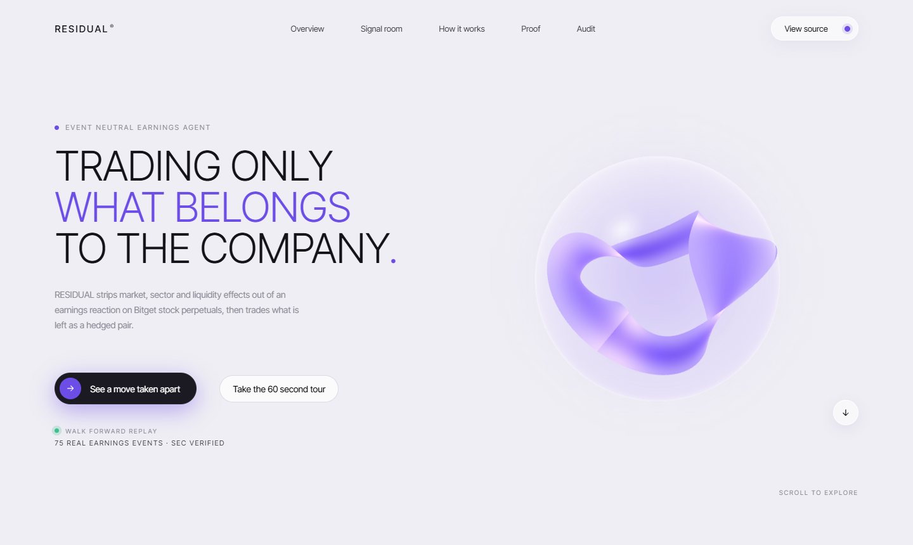
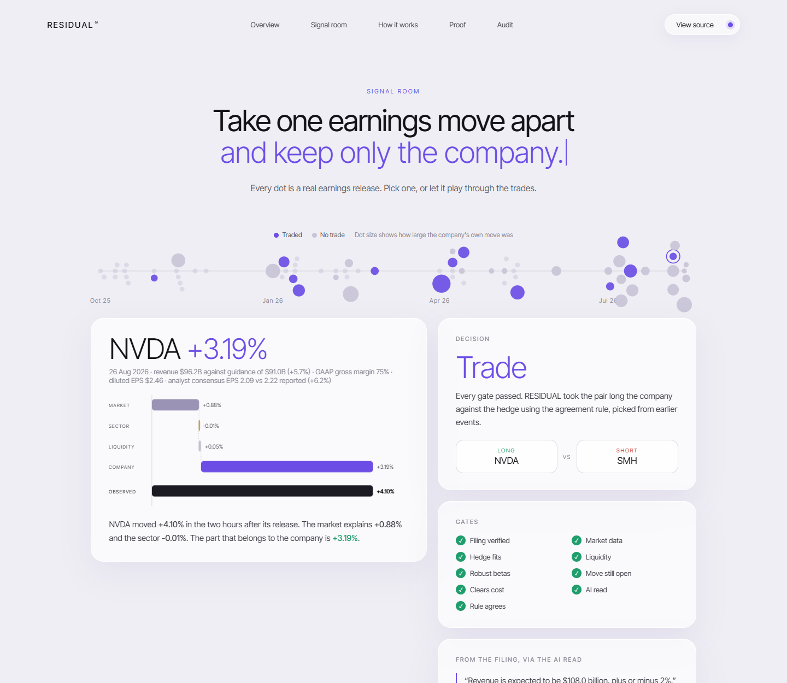
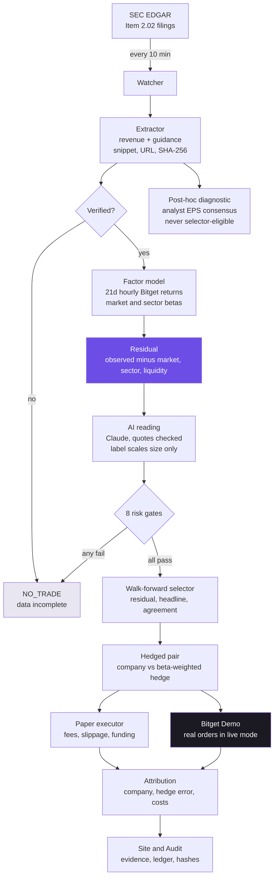
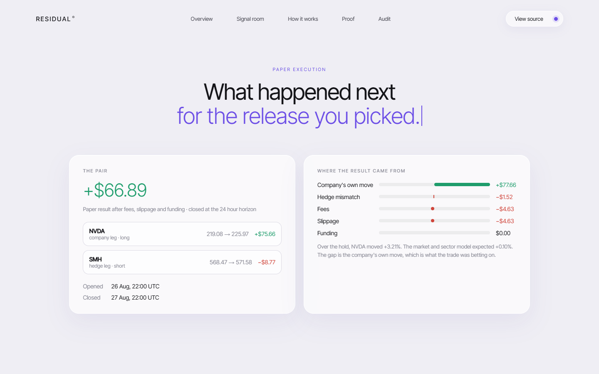
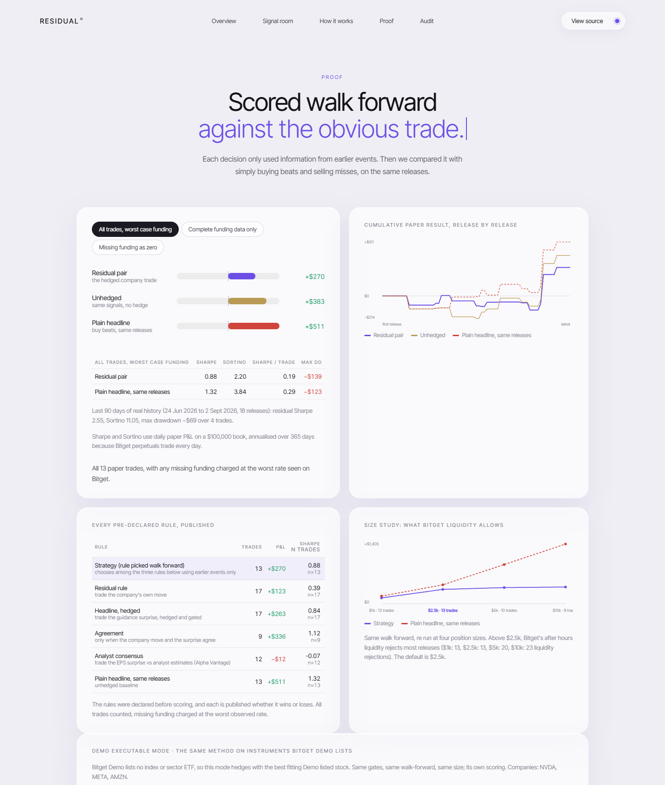
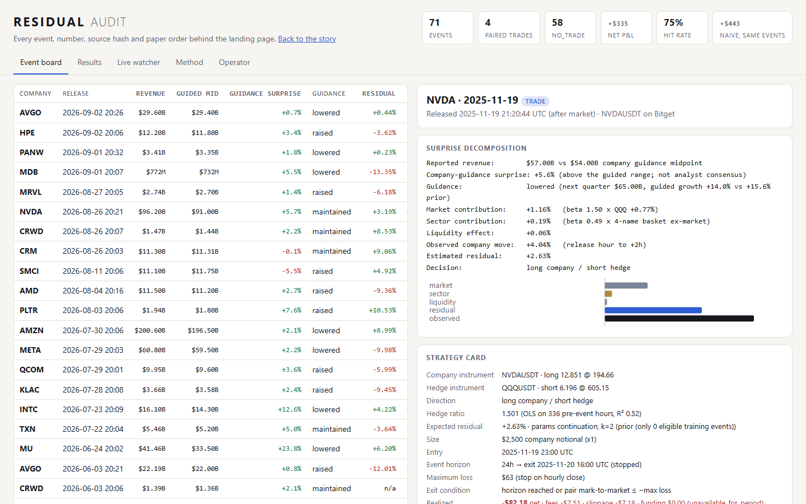

<p align="center">
  
</p>

<p align="center">
  <b>How much of that earnings move actually belonged to the company?</b><br>
  RESIDUAL strips the market, the sector and the liquidity effect out of an earnings reaction on Bitget
  stock perpetuals, and trades only what is left, hedged.
</p>

<p align="center">
  <a href="https://residual-teal.vercel.app"><b>Live app</b></a> ·
  <a href="https://residual-teal.vercel.app/dashboard"><b>Audit</b></a> ·
  <a href="https://github.com/jenzylove/residual/actions/workflows/ci.yml"></a>
</p>

<p align="center">
  
</p>

Built for the **Bitget AI Hackathon S2, Alpha Factory** track: earnings-driven trading, after-hours quotations, cross-market correlation and factor mining on US tokenized stocks.

## The problem

A stock jumps 6% after earnings. Most earnings bots buy that whole move. But a good part of it is usually the broad market rising in that hour, or the whole sector moving together, or simply thin after-hours pricing. Only the remainder belongs to the company.

RESIDUAL separates those four pieces on every release, trades only the company's part as a hedged pair, and shows the filing, the maths and the exchange order behind every decision. When the remainder is too small to beat costs, the hedge does not fit, or the book is too thin, it does nothing and says exactly why.

## Take one move apart

<p align="center">
  
</p>

NVDA moved **+4.10%** in the two hours after its release on 26 Aug 2026. The market explains **+0.88%**, the sector **−0.01%**, liquidity **+0.05%**. What belongs to the company is **+3.19%**, and that is what gets traded, long NVDA against short SMH, only because all eight gates passed.

## Architecture



**Data in:** SEC EDGAR (filings), Bitget public REST (hourly candles, fees, funding, order book), Alpha Vantage (analyst EPS consensus), Anthropic Claude (the reading).
**Nothing leaves** except Bitget Demo orders in live mode. No real-money order is ever placed.

## Product flow

| Step | What happens | Where to see it |
|---|---|---|
| 1. Catch | Watcher polls EDGAR for Item 2.02 earnings filings across 18 companies | Watcher card, `data/live_log.jsonl` |
| 2. Read | Revenue and the company's own guidance extracted, each with its snippet and document hash | Signal room evidence line, Audit |
| 3. Split | Hourly betas against QQQ and a sector peer basket remove market and sector | Signal room bars |
| 4. Second reading | Claude labels the move, quoting the filing; the label can only shrink a position | Signal room, AI card |
| 5. Gate | Eight checks; one failure means no trade, with the reason in plain words | Gates panel |
| 6. Trade | Company leg against a beta-weighted hedge, both legs, costs included | Paper execution |
| 7. Explain | Result split into company move, hedge error, fees, slippage, funding | Attribution panel |

<p align="center">
  
</p>

## Evidence contract

Every number on the site traces back to a document or an exchange response.

- **Earnings numbers** keep the exact sentence they came from, the SEC URL and the SHA-256 of the document. All 71 events verify, offline, against the archive in `data/sources/`.
- **Market inputs** are frozen per event in `data/snapshots/`, so the replay runs with no network at all.
- **AI answers** are cached in `data/interpretations/` with the prompt hash and raw response. Every quote is checked against the press release; an invented quote is rejected and the trade does not happen.
- **Paper orders** for both legs are in `data/ledger.csv`.
- **Demo orders** are real Bitget Demo order IDs in `data/keyrun_report.json` and `data/demo_strategy_trades.jsonl`.
- **CI** re-runs the replay on every push and fails if it does not reproduce the committed decisions.

## Results

<p align="center">
  
</p>

Walk-forward over 71 real earnings events at the $2,500 default size. Each decision used only information available before that release. The headline view counts **every trade**, charging missing funding at the worst rate observed.

| Rule | Net P&L | Trades | Sharpe |
|---|---|---|---|
| **Strategy** (rule picked walk-forward) | **+$269.68** | 13 | 0.88 |
| Agreement rule | +$335.83 | 9 | 1.12 |
| Headline rule, hedged | +$262.89 | 17 | 0.84 |
| Residual rule | +$123.04 | 17 | 0.39 |
| Analyst consensus diagnostic (post-hoc, never selected) | −$11.74 | 12 | −0.07 |
| **Naive headline, same events** | **+$511.29** | 13 | 1.32 |
| Naive headline, every eligible event | −$716.13 | 36 | −1.16 |

**Demo-executable mode**, the same method restricted to instruments Bitget Demo lists: **+$116.72 over 6 trades (Sharpe 0.70)** against the naive baseline's +$59.75 (0.35). One of those pairs was placed for real on Demo.

The size study (charted on the site) re-runs the whole walk-forward at $1k, $2.5k, $5k and $10k. Above $2,500, Bitget's after-hours liquidity rejects most releases.

## Honest limitations

- **No proven edge.** On the same releases the plain headline trade did better. We publish that rather than hide it. With 9 to 17 trades nothing here is statistically meaningful.
- **The surprise is a guidance surprise**, reported revenue against the company's own prior outlook, because the SEC publishes no consensus. A later-added analyst-EPS consensus series is published as a post-hoc diagnostic; it is never eligible for walk-forward selection and is the worst baseline.
- **Funding history** reaches back only about 90 days on Bitget, so older trades carry a worst-case funding charge.
- **Bitget Demo lists no index or sector ETF**, so main-mode strategy pairs cannot execute there. Demo mode exists for that reason, and the adapter refuses substitutes.
- **Liquidity binds the sample.** After-hours volume on these perpetuals is thin; 14 releases were rejected for it at $2,500.
- **AI labels are not deterministic** run to run; the cached answers are what make a replay reproducible.

## Quick start

Python 3.11+, no third-party packages.

```bash
python -m residual verify --offline   # re-derive every number from the archived filings
python -m residual replay --offline   # regenerate every result, no network
python -m unittest discover -s tests  # 56 tests
python -m residual serve              # the site at http://localhost:8000
```

Refreshing data, and live mode, need network and keys in `.env.local` (see `.env.example`):

```bash
python -m residual build              # SEC EDGAR -> data/events.json + data/sources/
python -m residual snapshot           # Bitget candles and funding -> data/snapshots/
python -m residual replay             # re-run, calling Claude for anything uncached
python -m residual live               # one watcher cycle (add --loop 600 to keep going)
python -m residual keyrun             # full Bitget Demo check: auth, coverage, roundtrip
python -m residual demo-strategy-trade --mode demo --notional 100
```

Windows, to keep the watcher running silently and publishing to the site:

```powershell
powershell -ExecutionPolicy Bypass -File scripts\install_watcher.ps1
```

## Audit

<p align="center">
  
</p>

Every table, source link, document hash, paper order and operator detail: [residual-teal.vercel.app/dashboard](https://residual-teal.vercel.app/dashboard).

## Layout

```
residual/   edgar.py extract.py events.py consensus.py   filings, extraction, provenance, consensus
            bitget.py market.py net.py                   Bitget data and frozen snapshots
            factors.py strategy.py paper.py              decomposition, gates, rules, paper fills
            interpret.py                                 validated AI reading
            demo.py live.py pipeline.py __main__.py      Demo execution, watcher, replay, CLI
web/        index.html landing.js body.css orb.js        landing page and 3D hero
            dashboard.html app.js style.css              audit
data/       events.json sources/ snapshots/ consensus/   the evidence
            results.json ledger.csv live_log.jsonl       the output
```

Paper trading research. Not investment advice.
