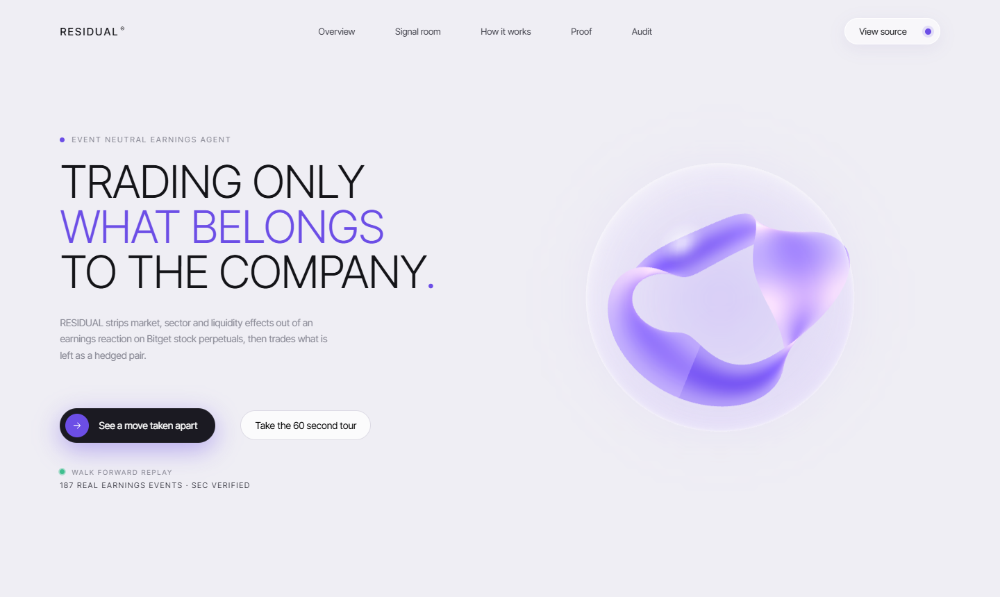
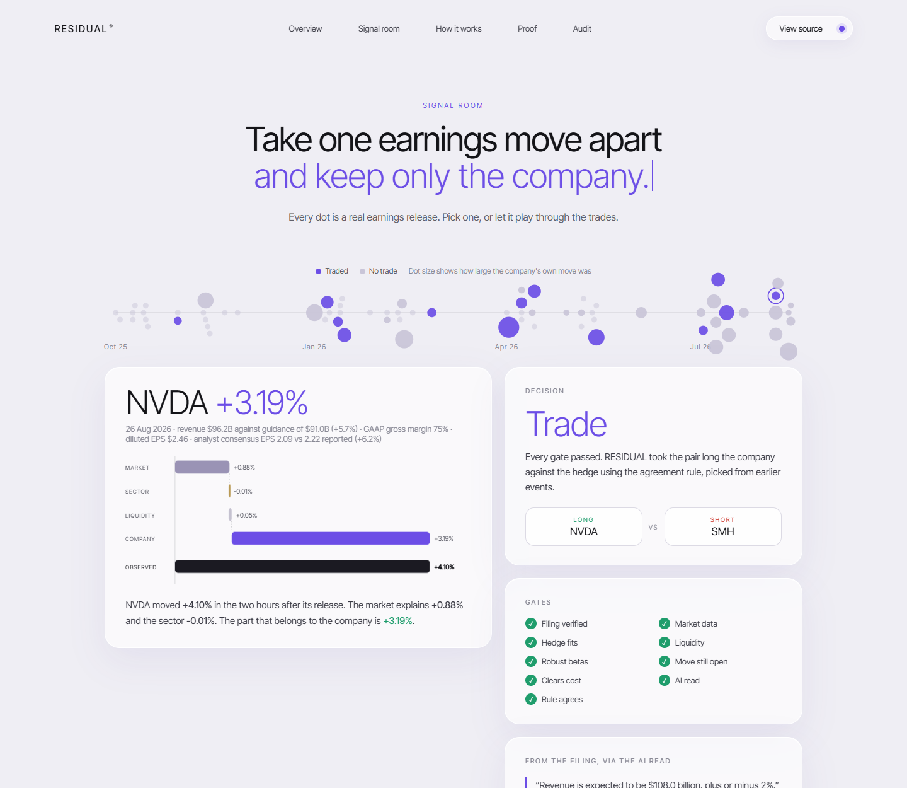
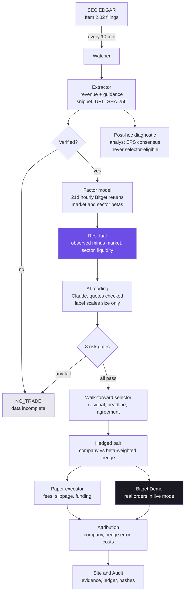
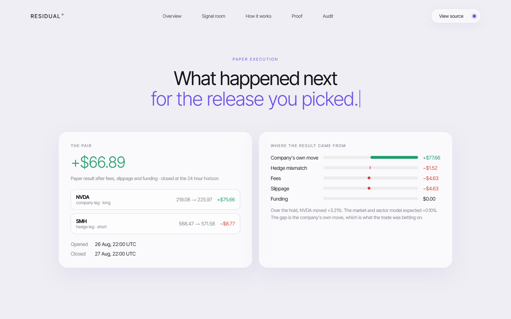
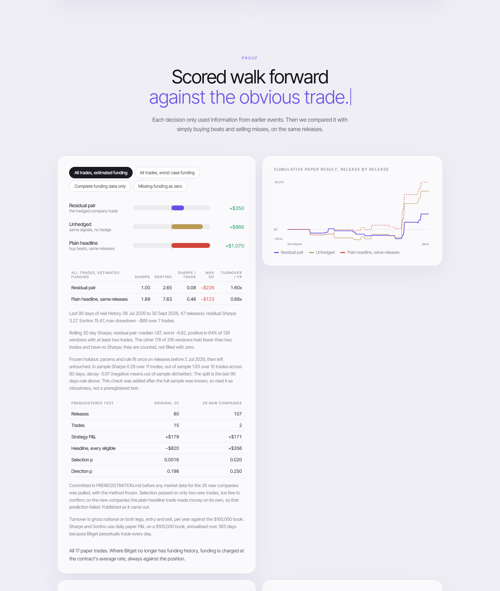
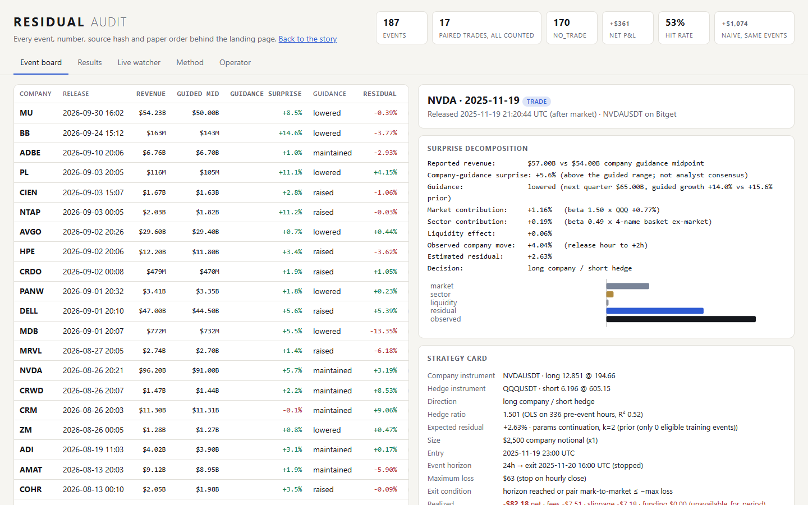

<p align="center">
  
</p>

<p align="center">
  <b>How much of that earnings move actually belonged to the company?</b><br>
  RESIDUAL strips the market, the sector and the liquidity effect out of an earnings reaction on Bitget
  stock perpetuals, and trades only what is left, hedged.
</p>

<p align="center">
  <a href="https://residual-teal.vercel.app"><b>Live app</b></a> ·
  <a href="https://residual-teal.vercel.app/dashboard"><b>Audit</b></a> ·
  <a href="https://github.com/jenzylove/residual/actions/workflows/ci.yml"></a>
</p>

<p align="center">
  
</p>

Built for the **Bitget AI Hackathon S2, Alpha Factory** track: earnings-driven trading, after-hours quotations, cross-market correlation and factor mining on US tokenized stocks.

## The problem

A stock jumps 6% after earnings. Most earnings bots buy that whole move. But a good part of it is usually the broad market rising in that hour, or the whole sector moving together, or simply thin after-hours pricing. Only the remainder belongs to the company.

RESIDUAL separates those four pieces on every release, trades only the company's part as a hedged pair, and shows the filing, the maths and the exchange order behind every decision. When the remainder is too small to beat costs, the hedge does not fit, or the book is too thin, it does nothing and says exactly why.

## Take one move apart

<p align="center">
  
</p>

NVDA moved **+4.10%** in the two hours after its release on 26 Aug 2026. The market explains **+0.88%**, the sector **−0.01%**, liquidity **+0.05%**. What belongs to the company is **+3.19%**, and that is what gets traded, long NVDA against short SMH, only because all eight gates passed.

## Architecture


```mermaid
flowchart TD
    A[SEC EDGAR<br/>Item 2.02 filings] -->|every 10 min| B[Watcher]
    B --> C[Extractor<br/>revenue + guidance<br/>snippet, URL, SHA-256]
    C --> D{Verified?}
    D -->|no| X[NO_TRADE<br/>data incomplete]
    D -->|yes| E[Factor model<br/>21d hourly Bitget returns<br/>market and sector betas]
    E --> F[Residual<br/>observed minus market, sector, liquidity]
    F --> G[AI reading<br/>Claude, quotes checked<br/>label scales size only]
    G --> H{8 risk gates}
    H -->|any fail| X
    H -->|all pass| I[Walk-forward selector<br/>residual, headline, agreement]
    C --> O[Post-hoc diagnostic<br/>analyst EPS consensus<br/>never selector-eligible]
    I --> J[Hedged pair<br/>company vs beta-weighted hedge]
    J --> K[Paper executor<br/>fees, slippage, funding]
    J --> L[Bitget Demo<br/>real orders in live mode]
    K --> M[Attribution<br/>company, hedge error, costs]
    L --> M
    M --> N[Site and Audit<br/>evidence, ledger, hashes]

    style F fill:#6c4ee6,color:#fff
    style X fill:#e8e6f0
    style L fill:#1b1a22,color:#fff
```

**Data in:** SEC EDGAR (filings), Bitget public REST (hourly candles, fees, funding, order book), Alpha Vantage (analyst EPS consensus), Anthropic Claude (the reading).
**Nothing leaves** except Bitget Demo orders in live mode. No real-money order is ever placed.

## Product flow

| Step | What happens | Where to see it |
|---|---|---|
| 1. Catch | Watcher polls EDGAR for Item 2.02 earnings filings across 46 companies | Watcher card, `data/live_log.jsonl` |
| 2. Read | Revenue and the company's own guidance extracted, each with its snippet and document hash | Signal room evidence line, Audit |
| 3. Split | Hourly betas against QQQ and a sector peer basket remove market and sector | Signal room bars |
| 4. Second reading | Claude labels the move, quoting the filing; the label can only shrink a position | Signal room, AI card |
| 5. Gate | Eight checks; one failure means no trade, with the reason in plain words | Gates panel |
| 6. Trade | Company leg against a beta-weighted hedge, both legs, costs included | Paper execution |
| 7. Explain | Result split into company move, hedge error, fees, slippage, funding | Attribution panel |

<p align="center">
  
</p>

## Evidence contract

Every number on the site traces back to a document or an exchange response.

- **Earnings numbers** keep the exact sentence they came from, the SEC URL and the SHA-256 of the document. All 192 filings (187 earnings releases) verify, offline, against the archive in `data/sources/`.
- **Market inputs** are frozen per event in `data/snapshots/`, so the replay runs with no network at all.
- **AI answers** are cached in `data/interpretations/` with the prompt hash and raw response. Every quote is checked against the press release; an invented quote is rejected and the trade does not happen.
- **Paper orders** for both legs are in `data/ledger.csv`.
- **Demo orders** are real Bitget Demo order IDs in `data/keyrun_report.json` and `data/demo_strategy_trades.jsonl`.
- **CI** re-runs the replay on every push and fails if it does not reproduce the committed decisions, metrics and significance tests.
- **Deployment** serves `version.json`: the commit the data was built from and the SHA-256 of every result file.

## Results

<p align="center">
  
</p>

### The test we set ourselves

On 9 October 2026 we committed [PREREGISTRATION.md](PREREGISTRATION.md) before downloading any market data for 26 companies the method had never seen: every Bitget listed US filer whose earnings release states a dollar outlook for next quarter's revenue. The method was frozen; only company entries and the patterns that read each release were added. Then we ran it, and publish what came out.

| | Original 20 | 26 new companies | Combined |
|---|---|---|---|
| Earnings releases | 80 | 107 | 187 |
| Releases with a tradeable Bitget market | 38 | 37 | 75 |
| Trades | 15 | 2 | 17 |
| Strategy net P&L | +$189.66 | +$171.31 | +$360.97 |
| Headline trade, every eligible release | −$809.79 | +$362.12 | −$447.67 |
| Selection beats chance (permutation p) | 0.0016 | 0.020 | 0.008 |
| Direction beats chance (permutation p) | 0.198 | 0.250 | 0.078 |

**How the predictions did.**
H1, selection beats chance on the new companies: p = 0.020, below 0.05. It passes on paper, but it rests on two trades (Lam Research +$33.10, Dell +$138.22), which is too few to confirm anything.
H2, the headline trade loses on the new companies and the strategy beats it: **failed.** Trading the headline direction on every eligible new release made +$362.12 over 37 trades, more than the strategy's +$171.31.
H3, direction choice stays insignificant: held (p = 0.25).

**Why so few new trades.** 69 of the 107 new releases came before the company's Bitget perpetual existed or had 21 days of history. Of the 37 that could be analysed, the gates passed 2: thin after hours books (26 releases) and hedges that did not fit (12) were the main reasons, which is what the gates are for on newly listed perpetuals.

### Five populations, never mixed

| Population | What it is | Size |
|---|---|---|
| Earnings releases | Every release examined, with SEC source, hashes and verified numbers | 187 releases |
| Main-mode backtest | Walk-forward strategy, hedged with index or sector ETFs | 17 trades (every trade counted) |
| Demo-mode backtest | Same method, restricted to instruments Bitget Demo lists | 6 trades |
| Demo execution checks | Historical decisions opened and closed in one pass on Bitget Demo | 6 pairs, net −$1.30 (venue cost) |
| Demo held pairs | Historical decisions held on Bitget Demo under the strategy's own exits | 3 closed, net −$10.52 |

The first three are research and backtest. The last two are real Bitget Demo orders, and their dollars come from Bitget's fills and fees. The two are never added together.

### Scorecard

Walk-forward over 187 releases, every trade counted, worst case funding charged where Bitget has no history (the conservative view). Sharpe and Sortino are on daily P&L over a $100,000 book, annualised over 365 days; Sharpe per trade is the mean over the standard deviation of each trade's return on its company notional. Turnover is gross notional on both legs, entry and exit, per year against the book.

| Metric | Strategy | Unhedged, same releases | Headline, same releases |
|---|---|---|---|
| Net P&L | +$360.97 | +$869.10 | +$1,073.61 |
| Trades | 17 | 17 | 17 |
| Sharpe, daily, annualised | 1.037 | 1.537 | 1.894 |
| Sharpe per trade | 0.092 | 0.359 | 0.462 |
| Sortino, daily, annualised | 2.766 | 5.346 | 7.678 |
| Max drawdown | −$218.68 | −$231.25 | −$122.35 |
| Turnover per year | 1.60x | 0.66x | 0.66x |
| Rolling 30 day Sharpe | median 1.96, worst −4.92, positive in 64% of defined windows | | |
| Frozen holdout | in sample 0.354, out of sample 1.925, decay −4.44 | | |

**Rolling 30 day Sharpe** slides a 30 day window one day at a time. 138 of 316 windows hold at least two trades and have a Sharpe; the other 178 have no Sharpe, and are counted, not filled with zero. Costs (fees plus slippage) are 12.6 bps of turnover and 35% of gross P&L.

**Frozen holdout.** Alongside the walk-forward, params and rule are fit once on every release before 2 July 2026 (the last 90 days boundary) and then left untouched. In sample: Sharpe 0.354 over 11 trades. Out of sample, 90 days: Sharpe 1.925 over 15 trades, so out of sample did better, not worse (decay −4.44; the alert level is out of sample below half of in sample). This check was added after the original sample was known, so read it as robustness. The preregistered test above is the one that was not.

**Permutation tests.** Selection: the releases the strategy traded are scored with the plain headline trade and compared with 200,000 random sets of the same size drawn from every release where that trade was possible. Direction: the strategy's chosen direction against every possible flip of the same trades (exact). Both are seeded and reproduced in CI.

### Backtest, walk-forward, every trade counted

Walk-forward over 187 releases at the $2,500 default size. Each decision used only information available before that release, including funding: each event's worst case funding charge uses only settlements before its release. Missing funding is charged at that worst rate.

| Rule | Net P&L | Trades | Sharpe (daily, annualised) | Max drawdown |
|---|---|---|---|---|
| **Strategy** (rule picked walk-forward) | **+$360.97** | 17 | 1.037 | −$218.68 |
| Agreement rule | +$494.43 | 13 | 1.455 | −$85.22 |
| Headline rule, hedged | +$408.31 | 24 | 1.173 | −$220.39 |
| Residual rule | +$333.73 | 24 | 0.924 | −$222.30 |
| Analyst consensus diagnostic (post hoc, never selected) | +$25.20 | 16 | 0.150 | −$152.92 |
| **Headline direction, same events, unhedged** | **+$1,073.61** | 17 | 1.894 | −$122.35 |
| Headline direction, every eligible event | −$447.67 | 75 | -0.386 | −$1,169.29 |

**Funding complete view.** Bitget keeps about 90 days of funding history. Counting only trades whose funding was actually observed leaves 7 trades: +$489.18, Sharpe 1.537 daily (0.429 per trade), max drawdown −$68.84. Every other number in this README uses the conservative view above unless it says otherwise.

**What this shows.** The value is in which releases RESIDUAL agrees to trade. Taking the headline direction on every eligible release loses $447.67; taking it only on the releases that clear RESIDUAL's gates makes +$1,073.61. Inside those releases the hedge cost more than it saved, so the unhedged baseline beats the strategy. We report the strategy the walk-forward selected, not the baseline, because picking the winner after seeing the results would be hindsight.

**Demo-executable mode** (conservative view): +$122.19 over 6 trades (Sharpe 0.728) against the same-events baseline's +$64.60 (0.382). This is the one population where the strategy beats its baseline.

### Real orders on Bitget Demo

Held pairs are managed by the watcher with the backtest's own exits: a combined pair stop at 2.5% of company notional, or the holding period. Closing is restart safe; each leg's close has a fixed order ID, so a retry checks the exchange before sending anything.

- META-2026-07-29: held 6.93h, exit pair stop at -8.61%, net per Bitget −$8.38. It passed the -2.5% stop before the live stop existed; it closed on the first watcher cycle after the stop shipped, which is why the loss is past the stop.
- NVDA-2025-11-19: held 24.14h, exit holding period, net per Bitget −$0.52.
- AMZN-2026-02-05: held 24.13h, exit holding period, net per Bitget −$1.62.

Execution checks: 6 pairs, net −$1.30 in total, which is the venue's round trip cost and says nothing about the strategy.

The size study (charted on the site) re-runs the whole walk-forward at $1k, $2.5k, $5k and $10k. Above $2,500, Bitget's after hours liquidity rejects most releases.

## Honest limitations

- **The sample is bounded by the venue, not by the method.** 187 releases were examined across 344 days, but a release is only tradeable if the company's Bitget perpetual already existed with enough history at that moment. That leaves 75 analysable releases, of which 17 cleared every gate. Arista is the clearest case: its perpetual listed on 12 August 2026, eight days after its 4 August earnings, so that release can never be traded however good the signal was.
- **Seventeen trades cannot establish an edge.** The selection test is significant in the original sample and in the combined one, but the out of sample test on new companies produced only two trades, and on those companies the plain headline trade made money on its own (prediction H2 failed). A larger out of sample record is what would settle it.
- **The hedge did not pay.** Unhedged on the same releases returned +$869.10 against +$360.97 hedged in the conservative view, and +$1,013.17 against +$489.18 in the funding complete view. On this sample the hedge cost return. That is published here rather than buried, and it is the first thing a larger sample should settle.
- **The surprise is a guidance surprise**, reported revenue against the company's own prior outlook, because the SEC publishes no consensus. A later-added analyst-EPS consensus series is published as a post-hoc diagnostic; it is never eligible for walk-forward selection.
- **Funding history** reaches back only about 90 days on Bitget, so older trades carry a worst case funding charge, computed point in time. The tables above count those trades; the view that drops them has 7 trades for +$489.18.
- **Bitget Demo lists no index or sector ETF**, so main-mode strategy pairs cannot execute there. Demo mode exists for that reason, and the adapter refuses substitutes.
- **Thin books cap size rather than rejecting the release.** The position is the largest notional that stays inside 25% of the observed pre-event hourly volume, up to the $2,500 base, and the release is dropped only if that falls below a fifth of base. Volume is measured before the release, so this changes size and never the decision.
- **AI labels are not deterministic** run to run; the cached answers are what make a replay reproducible.

## Sample window and out-of-sample split

First release 2025-10-21, last release 2026-09-30: 344 days, comfortably past the 60-day minimum. Every event is scored with parameters fitted only on events whose exit precedes that event's release, so every scored trade is out of sample by construction. The rule itself (residual, headline or agreement) is chosen the same way, walk-forward, and the selection for each event is recorded in `web/data.json`. Two further out of sample checks sit on top: the frozen holdout (a conventional in sample and out of sample split, for the decay metric) and the preregistered test on 26 companies the method had never seen.

## Quick start

Python 3.11+, no third-party packages.

```bash
python -m residual verify --offline   # re-derive every number from the archived filings
python -m residual replay --offline   # regenerate every result, no network
python -m unittest discover -s tests  # full suite
python -m residual serve              # the site at http://localhost:8000
```

Refreshing data, and live mode, need network and keys in `.env.local` (see `.env.example`):

```bash
python -m residual build              # SEC EDGAR -> data/events.json + data/sources/
python -m residual snapshot           # Bitget candles and funding -> data/snapshots/
python -m residual replay             # re-run, calling Claude for anything uncached
python -m residual live               # one watcher cycle (add --loop 600 to keep going)
python -m residual keyrun             # full Bitget Demo check: auth, coverage, roundtrip
python -m residual demo-strategy-trade --mode demo --notional 100
```

Windows, to keep the watcher running silently and publishing to the site:

```powershell
powershell -ExecutionPolicy Bypass -File scripts\install_watcher.ps1
```

## Audit

<p align="center">
  
</p>

Every table, source link, document hash, paper order and operator detail: [residual-teal.vercel.app/dashboard](https://residual-teal.vercel.app/dashboard).

## Layout

```
residual/   edgar.py extract.py events.py consensus.py   filings, extraction, provenance, consensus
            bitget.py market.py net.py                   Bitget data and frozen snapshots
            factors.py strategy.py paper.py              decomposition, gates, rules, paper fills
            interpret.py                                 validated AI reading
            demo.py live.py pipeline.py __main__.py      Demo execution, watcher, replay, CLI
web/        index.html landing.js body.css orb.js        landing page and 3D hero
            dashboard.html app.js style.css              audit
data/       events.json sources/ snapshots/ consensus/   the evidence
            results.json ledger.csv live_log.jsonl       the output
```

Paper trading research. Not investment advice.
